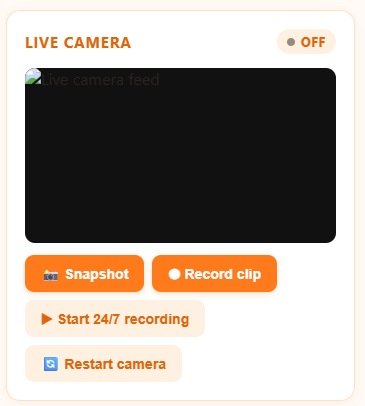
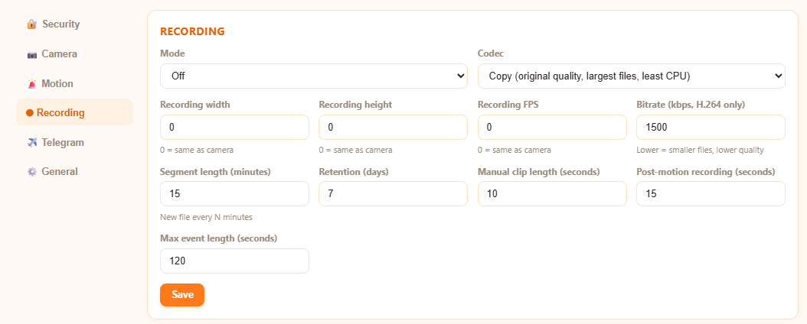
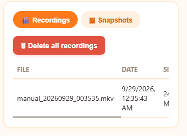
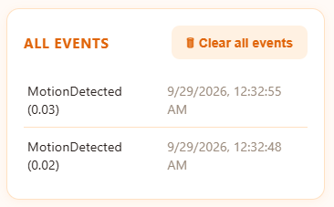
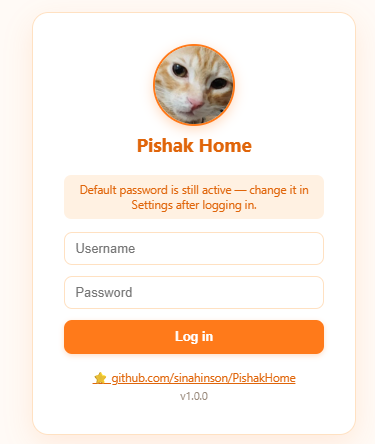

<div align="center">
<p align="center">
  
</p>

<h1 align="center">Pishak Home</h1>


**A lightweight, self-hosted pet monitoring system for Raspberry Pi.**
Live camera · Motion detection · 24/7 recording · Telegram alerts · Password-protected web panel.


</div>

---

## Table of contents

- [Why Pishak Home?](#-why-pishak-home)
- [Features](#-features)
- [Requirements](#-requirements)
- [Installation](#-installation)
- [Run as a service (systemd)](#-run-as-a-service-systemd)
- [Using the panel](#-using-the-panel)
- [Recording modes & file size](#-recording-modes--file-size)
- [Telegram notifications & proxy](#-telegram-notifications--proxy)
- [Architecture](#-architecture)
- [Security](#-security)
- [Troubleshooting](#-troubleshooting)
- [Development & tests](#-development--tests)
- [Screenshots](#-screenshots)
- [Support the project](#-support-the-project)
- [License](#-license)

## 🐱 Why Pishak Home?

It started as a way to keep an eye on one very good cat named **Pishak** using a Raspberry Pi 3B+ and an old USB webcam — without cloud accounts, subscriptions, or a heavy NVR stack. The whole thing is **one small Python app** that runs comfortably on ~1 GB of RAM and keeps working with no internet at all.

## ✨ Features

| | |
|---|---|
| 📷 **Live view** | Native MJPEG stream from a USB webcam, no transcoding, shared by every feature |
| 🚨 **Motion detection** | Lightweight frame differencing (no OpenCV), adjustable sensitivity |
| ⏺ **3 recording modes** | Off · record on motion · **continuous 24/7 until you press Stop** |
| 📉 **Small files** | Choose *copy* (original quality) or **H.264** with your own bitrate, resolution and FPS |
| 🗂 **Files in the panel** | Browse, download and bulk-delete recordings and snapshots |
| 📡 **Network card** | Every interface: IP, link state, speed and live RX/TX throughput |
| ✈️ **Telegram alerts** | Motion alerts arrive **with the snapshot photo** (optional), cooldowns, authorized chat IDs, optional **HTTP / SOCKS5 proxy** |
| ⚙️ **Everything editable in the UI** | Camera, motion, recording, Telegram, storage — no config files, no restarts |
| 🔐 **Login protected** | PBKDF2 passwords, CSRF protection, brute-force lockout |
| 🔄 **Self-healing camera** | Auto-reconnect with backoff, live diagnostics, and a one-click **Restart camera** button |
| 🧹 **Housekeeping** | Retention by days, low-storage warning, clear events / recordings / snapshots, factory reset |

Every feature can be switched on or off from the Settings page.

## 🧰 Requirements

- Raspberry Pi 3B+ (or any Linux box) running Debian/Raspberry Pi OS
- Python 3.11+
- `ffmpeg` and `v4l-utils`
- A USB webcam that outputs MJPEG (most do)

```bash
sudo apt update
sudo apt install -y ffmpeg v4l-utils python3-venv
```

## 🚀 Installation

```bash
git clone https://github.com/sinahinson/PishakHome.git
cd PishakHome

python3 -m venv .venv
source .venv/bin/activate
pip install -r requirements.txt

cp config/settings.example.yaml config/settings.yaml   # optional: first-boot defaults

uvicorn app.main:app --host 0.0.0.0 --port 8000
```

Open `http://<raspberry-pi-ip>:8000` and sign in.

> **Default login:** username `pishak` · password `pishak`
> Change both immediately in **Settings → Security**. The panel reminds you until you do.

Make sure your user can read the camera:

```bash
sudo usermod -aG video $USER    # then log out and back in
```

### Quick camera sanity check

```bash
v4l2-ctl -d /dev/video0 --list-formats-ext
ffmpeg -f v4l2 -input_format mjpeg -video_size 1920x1080 -framerate 30 \
  -i /dev/video0 -t 10 -c:v copy test.mkv
```

## 🛠 Run as a service (systemd)

Create `/etc/systemd/system/pishak-home.service` (adjust the paths and user):

```ini
[Unit]
Description=Pishak Home
After=network.target

[Service]
User=pi
WorkingDirectory=/home/pi/PishakHome
ExecStart=/home/pi/PishakHome/.venv/bin/uvicorn app.main:app --host 0.0.0.0 --port 8000
Restart=always
RestartSec=3

[Install]
WantedBy=multi-user.target
```

```bash
sudo systemctl daemon-reload
sudo systemctl enable --now pishak-home
journalctl -u pishak-home -f
```

## 🖥 Using the panel

| Page | What you can do |
|---|---|
| **Live** | Watch the camera, take a snapshot, record a clip, start/stop 24/7 recording, **restart the camera**, see system / camera / network status |
| **Events** | Browse motion and system events, **clear all events** |
| **Recordings** | Download recordings and snapshots, **delete all recordings**, **delete all snapshots** |
| **Settings** | Security, Camera, Motion, Recording, Telegram (+ proxy), General & Storage, and a password-confirmed **Reset all settings** |

`config/settings.yaml` is only read once, to seed a brand-new database. After that, the Settings page is the single source of truth.

## 🎥 Recording modes & file size

- **Off** — nothing records automatically (manual clips still work).
- **Record on motion** — starts on motion, extends while motion continues, stops after a quiet period, with a hard maximum length per event.
- **Continuous 24/7** — records non-stop in segments (default 15 min) until you press **Stop**. Resumes automatically after a restart.

All modes share the *same* camera stream that feeds the live view — the camera is never opened twice, so live view keeps working while recording.

**Shrinking recordings:** set the codec to **H.264**, pick a bitrate (e.g. 800–1500 kbps) and, if you like, a lower resolution/FPS than the live view. H.264 costs CPU; on a Pi 3B+ keep it modest (e.g. 640×360 @ 10 fps) and watch the CPU figure on the Live page.

## ✈️ Telegram notifications & proxy

1. Create a bot with [@BotFather](https://t.me/BotFather) and copy the token.
2. In **Settings → Telegram** paste the token, add your chat ID(s), enable notifications.
3. If Telegram is blocked on your network, enable **Use a proxy** and enter e.g. `http://127.0.0.1:8080` or `socks5h://127.0.0.1:1080`.
4. Press **Test connection**.
5. Leave **Send the snapshot with motion alerts** on to receive the photo that triggered each alert (if the photo can't be delivered, you still get the text alert).

Only authorized chat IDs are ever contacted, and repeated events are rate-limited by a configurable cooldown.

## 🏗 Architecture

```
PishakHome/
├── app/
│   ├── main.py              # FastAPI app, routes, wiring
│   ├── camera.py            # ffmpeg MJPEG capture, auto-recovery, frame subscribers
│   ├── recorder.py          # StreamRecorder + RecordingController (manual/event/24-7)
│   ├── detection.py         # motion detection
│   ├── events.py            # event bus with cooldowns
│   ├── notifications.py     # Telegram (HTTP/SOCKS5 proxy support)
│   ├── network.py           # interface status & live throughput
│   ├── settings_manager.py  # DB-backed, UI-editable settings
│   ├── auth.py              # passwords, sessions, CSRF, lockout
│   ├── system.py            # CPU / RAM / disk
│   ├── database.py          # SQLite layer
│   └── config.py            # static config + first-boot seed
├── templates/  static/      # orange/white responsive UI
├── docs/screenshots/        # README images
└── tests/                   # 172 tests
```

Stack: Python · FastAPI · Uvicorn · SQLite · ffmpeg · httpx · psutil.
Design goals: low RAM/CPU, local-first, modular, no Docker, no cloud.

## 🔒 Security

- Passwords hashed with PBKDF2-HMAC-SHA256 (200k iterations, per-user salt).
- `HttpOnly`, `SameSite=Strict` session cookies and a per-session CSRF token on every state-changing request.
- 5 failed logins from one address ⇒ 30-second lockout.
- Secrets (password hash, bot token) live in the database, never in a committed file; `config/settings.yaml` is git-ignored.
- The Telegram bot token is never written to the logs (HTTP request logging that would contain it is silenced, and error messages are sanitized).
- **Don't expose the panel directly to the internet.** Use a VPN or tunnel for remote access.
- Change the default password on first login.

## 🩺 Troubleshooting

| Problem | Fix |
|---|---|
| `address already in use` on port 8000 | An old instance is still running: `sudo fuser -k 8000/tcp`, then start again |
| Live view is black / `permission denied` | `sudo usermod -aG video $USER`, then log out and in |
| Camera was unplugged or shook loose | Plug it back in and press **🔄 Restart camera** on the Live page (otherwise it retries automatically with growing delays, up to 30 s) |
| Motion stopped after the camera was unplugged | Fixed in 1.0.0: motion pauses while the camera is disconnected and resumes on its own; a watchdog restarts the motion worker if it ever dies. Toggling motion off/on or pressing **Restart camera** also revives it |
| Camera health shows an error | Open `/api/camera/health` — `recent_log` contains ffmpeg's own messages |
| Telegram test fails | Check the token, chat ID and, on restricted networks, the proxy URL |
| Recordings are huge | Switch codec to **H.264** and lower bitrate / resolution / FPS |

## 🧪 Development & tests

```bash
pip install -r requirements.txt
python -m pytest tests/ -q
```

The suite (172 tests) covers authentication, settings, recording control, motion detection, the event bus, camera failure/recovery (with a fake `ffmpeg`), network stats and the whole HTTP API. Camera behaviour on real hardware and the Telegram API/proxy path are the parts that can only be confirmed on your own device — run the sanity checks above after installing.

## 📸 Screenshots

| Live | Settings |
|---|---|
|  |  |

| Recordings & snapshots | Events |
|---|---|
|  |  |

| Login |
|---|
|  |

## ❤️ Support the project

Pishak Home is free and open source. If it keeps your pet (or your peace of mind) safe, you can help it grow:

- ⭐ **Star the repo** — it's free and it really helps
- 🐛 Open issues and pull requests
- ☕ Donate (replace the placeholders below with your own details):

| Method | Link / address |
|---|---|
| Buy Me a Coffee | `https://coffeebede.com/cena` |
| Crypto Donate | `https://nowpayments.io/donation/cena` |
| USDT (TRC20) | `TPX8bBrZnAXD9sbHJYu1kUwTbKkdZfpXgH` |
| TRON (TRX) | `TPX8bBrZnAXD9sbHJYu1kUwTbKkdZfpXgH` |

## 📄 License

MIT — see [LICENSE](LICENSE).

---

<div align="center" dir="rtl">

### 🐈 Message from Pishak

**Meow! 😺 My owner made this project especially for me so that he can see what I am doing when he is not at home.**
**(Well, yeah, I'm sleeping most of the time 😴)**
**Be sure to give it a ⭐ star — or I'll go through his keyboard tonight and delete all his files! 🐾**

</div>
